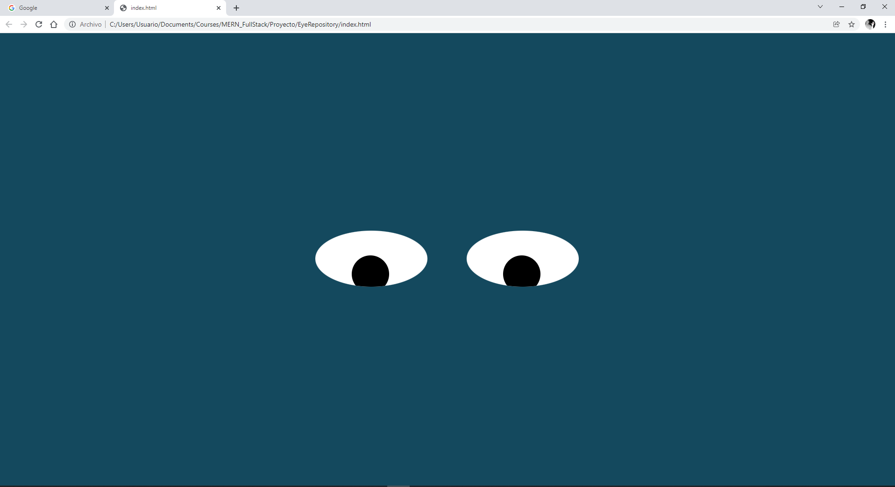

# Eyes
## Description

Proyecto mostrando la funcionalidad de los estilos en styles.css y tambien la funcionalidad del evento onmouseMove(); y el como son llamadas a traves del atributo class en los objetos dentro dle HTML

## How to run

La ejecucion es abriendo el archivo index.html en cualquier browser, si deseas ver con consola te recomiendo Google Chrome; solo es mover el puntero de mouse y los ojos se moveran en dirección a éste.

## Improvements

Agregarle un header, y simular el parpadeo de los ojos.

## Exercise on eyes

